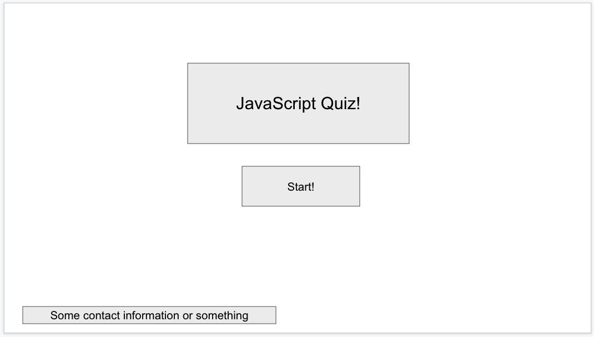
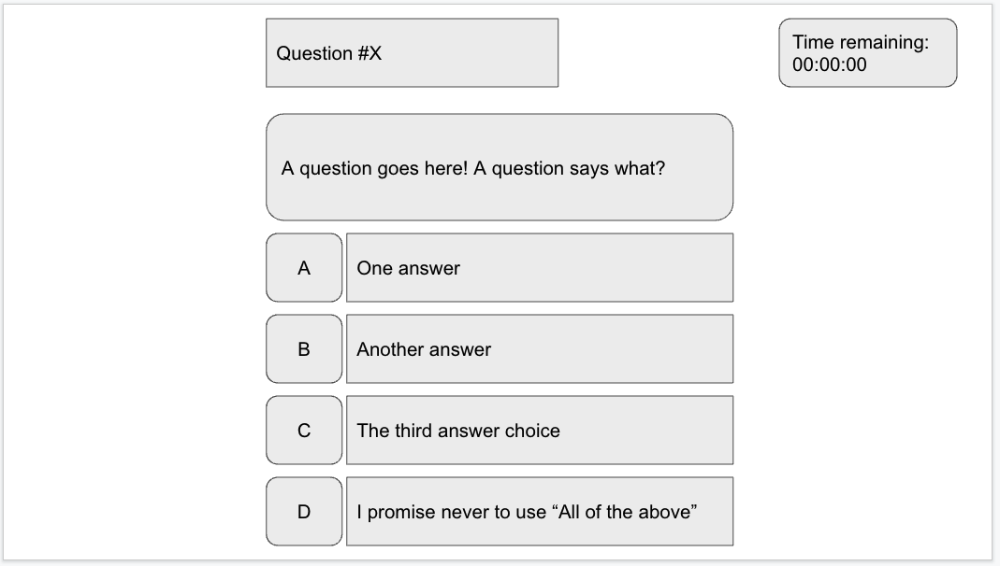
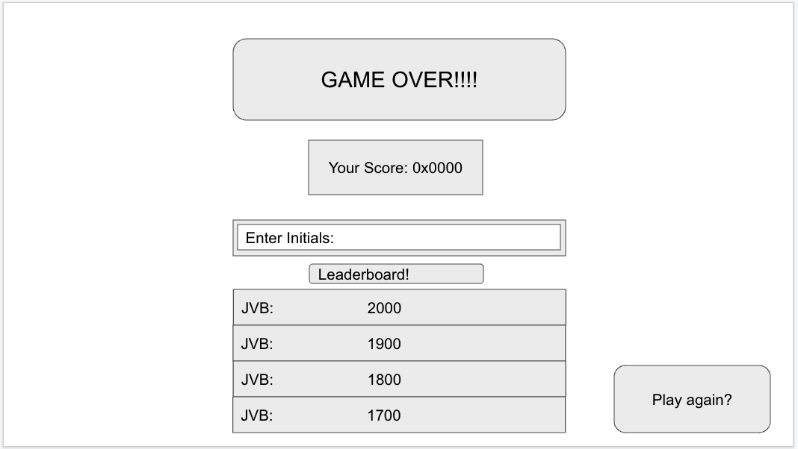

# js-quiz
A small quiz app about javascript. It is currently hosted at https://jvbridge.github.io/js-quiz/

## Description

This is a short quiz about JavaScript. It showcases knowledge of JavaScript in
the types of questions asked as well as in the way it is implemented.

### Wireframe

The basic idea is that there will be three states the applette will be in. 
 1. Before the quiz start
 2. During the quiz
 3. After the quiz

These are represented respectively in the wireframe as shown

## Usage

The app starts in wireframe state 1.

When the user clicks "Start!" The applette switches to state 2. The User is
presented with a timer showing how much time is remaining. 

They are also presented with a question, and four possible answers. 
When they click on the buttons next to the answers they are shown the applette 
will switch to the next question, or subtract time from the timer depending upon
whether the answer is correct or incorrect.

When no questions remain or the time remaining is 0, the applette will switch to
state 3 where the user is given the option to save their score with their 
initials
## Credits

Made by Jonathan Bridge 
Github.com/jvbridge

